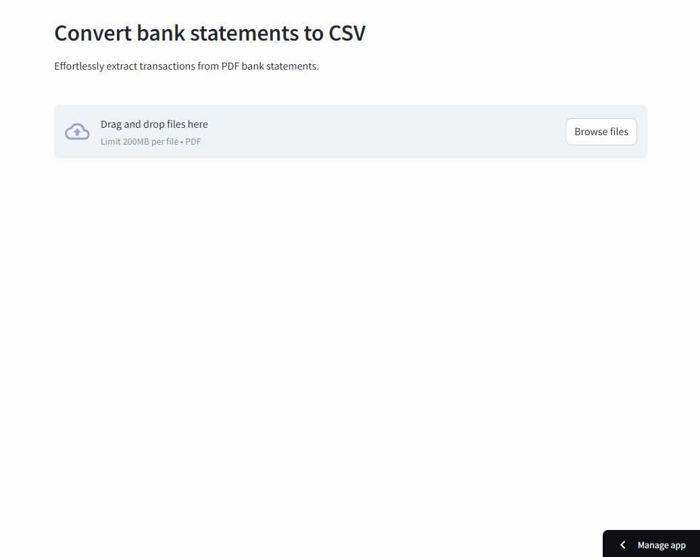

Statement Sensei helps converts bank statement PDFs to CSVs using the [monopoly](https://github.com/benjamin-awd/monopoly) CLI library. The offline version of the app is available on the [releases](https://github.com/benjamin-awd/statementsensei/releases) page.

<h3 align="center">
    🎉 Statement Sensei is now live! 🎉
    <br><br>
    Try it out: <br>
    <a href="https://statementsensei.streamlit.app/">https://statementsensei.streamlit.app/</a>
</h3>

<p align="center">
    
</p>

# Usage

Statement Sensei can be run as an offline application on Windows, MacOS or Linux.

The offline application runs Streamlit locally, and uses a [WebView](https://tauri.app/v1/references/webview-versions/) window to view the browser frontend at http://localhost:8501.

Currently supported banks:
| Bank                | Credit Statement    | Debit Statement     |
| --------------------| --------------------| --------------------|
| Citibank            | ✅                 | ❌                  |
| DBS/POSB            | ✅                 | ✅                  |
| HSBC                | ✅                 | ❌                  |
| Maybank             | ✅                 | ✅                  |
| OCBC                | ✅                 | ✅                  |
| Standard Chartered  | ✅                 | ❌                  |

# Installation

> [!WARNING]
> The offline app may raise security warnings during installation.

Specifically on MacOS, the application will show an "app is damaged and can't be opened" error.

These security warnings happen because the release binaries are unsigned, and are incorrectly flagged as malware.

To get around this, follow these steps for [MacOS](https://support.apple.com/en-sg/guide/mac-help/mh40616/mac) / [Windows](https://stackoverflow.com/questions/54733909/windows-defender-alert-users-from-my-pyinstaller-exe).

The Windows Defender alert can be bypassed by clicking "More info" -> "Run anyway".

# Development

Install dependencies with Poetry:
```shell
poetry install
poetry shell
```

To run the consumer-facing application:
```shell
python entrypoint.py
```

To run the application in developer mode:
```shell
streamlit run webapp/app.py
```

# Features
- Supports uploading multiple bank statements
- Allows unlocking of PDFs using user-provided credentials via the frontend
